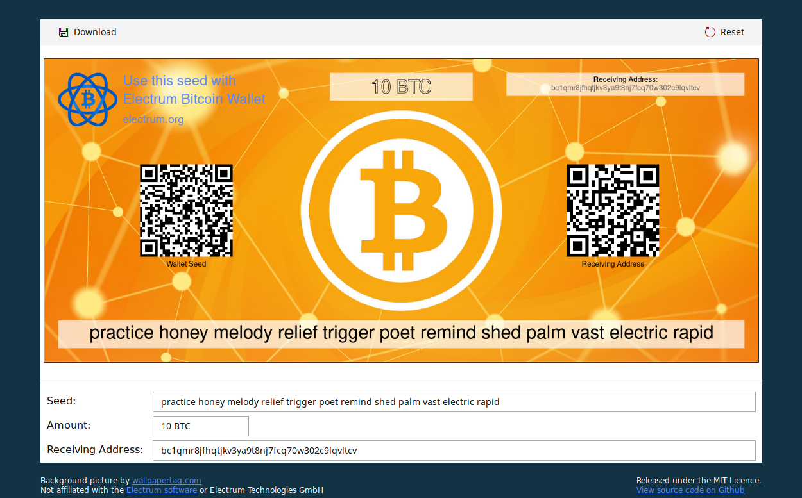

# Electrum Bitcoin Paper Wallet

This app creates a printable Bitcoin paper wallet based on an [Electrum](https://electrum.org) wallet seed.
The wallet is rendered in real time using canvas techniques and can be downloaded as PNG.

It's a simple and modern open source web application based on React and Redux.
The code runs completely on client side and no data will be transferred to any server or third party.

## Usage / Installation

The working version is hosted on Github Pages and can be found [here](https://fensterbank.github.io/electrum-bitcoin-paper-wallet).

But be aware: if you want 100% security, you should never enter your wallet seed on a computer with an internet connection, and especially not on a website.

Although this app is open source and doesn't want to harm you, your computer may still be infected with viruses and Trojan horses, or malicious browser plug-ins may be just waiting for you to open this app.  
In addition, anyone can take the code of this app, modify it and host it on a different domain.

We strongly encourage you to download the code yourself, install the dependencies with npm and run the application locally, preferably on an offline computer.

1. Download [nodejs 9](https://nodejs.org/). You need this on every computer where you want to compile or run it.
2. Download the ZIP of the Repository.  
If you have [https://git-scm.com/](git) installed, you may also clone this respository by opening the command line and entering `git clone https://github.com/Fensterbank/electrum-bitcoin-paper-wallet.git`.
3. Open a command line interface, go to the folder containing the code and enter `npm install`.  
This will install all dependencies to run the app.
4. Now you are ready. You could could copy the whole folder to your cold storage offline computer.
5. To run the app locally, open the command line interface and enter `npm run start`.  
As long as you have nodejs installed, ran `npm install` before and copied the whole directory (including `node_modules`), you could do this on any computer without internet connection.

## Screenshot

## License

MIT License